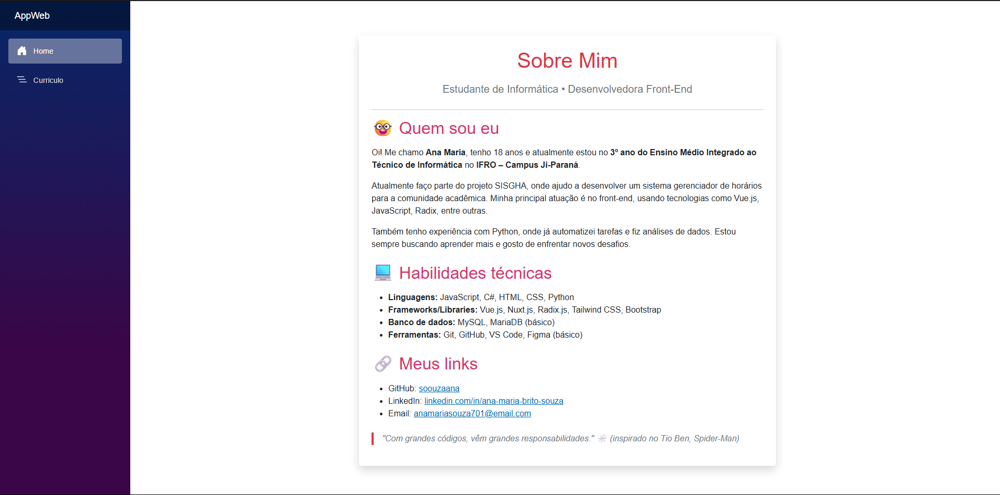
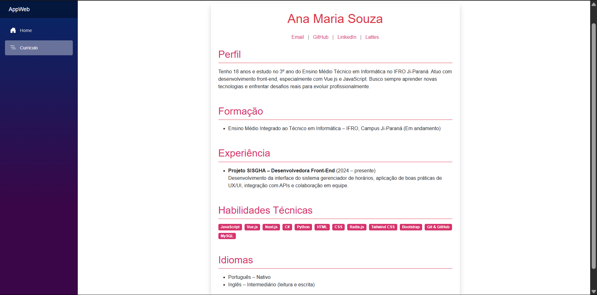

# 💼 Currículo e Sobre Mim - Ana Maria Souza

Este repositório faz parte de uma atividade da disciplina de **Projeto de Desenvolvimento de Sistemas**, e contém as páginas desenvolvidas em HTML, CSS puro e Razor para apresentar meu currículo e uma seção "Sobre Mim", utilizando o framework Bootstrap.

---

## 🖥 Tecnologias Utilizadas

- HTML5  
- CSS3  
- Razor Pages (.NET)  
- Bootstrap 5

---

## 📷 Prévia

### Sobre Mim  

### Currículo  

